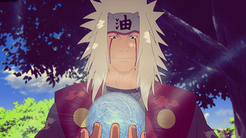

# rasengan：这是一个图形学学习的项目

## 关于项目项目名字 rasengan:
    * 中文翻译：螺旋丸，来自《火影忍者》 自来教鸣人修炼的一个忍术：螺旋丸，就是下图这位大叔手里的球
* 
  * 相信看过火影的都会会知道（不知道的可以从86集开始）。这个术看起来很简单，但是要学成就必须要苦练基本功，在练习中掌握原理，把各种变化融汇贯通，才能把气球打破。
  * 取这个名字的寓意：在学习计算机图形学的过程中 数学原理和一门能把理论变成可视图像产出的工具语言这两者的结合，就是我们职业生涯中要掌握的“螺旋丸”，把基础练好，就很有机会让基础技术慢慢演变，最终产出很厉害的效果
  * 够中二，够热血，才能让自己坚持下去
